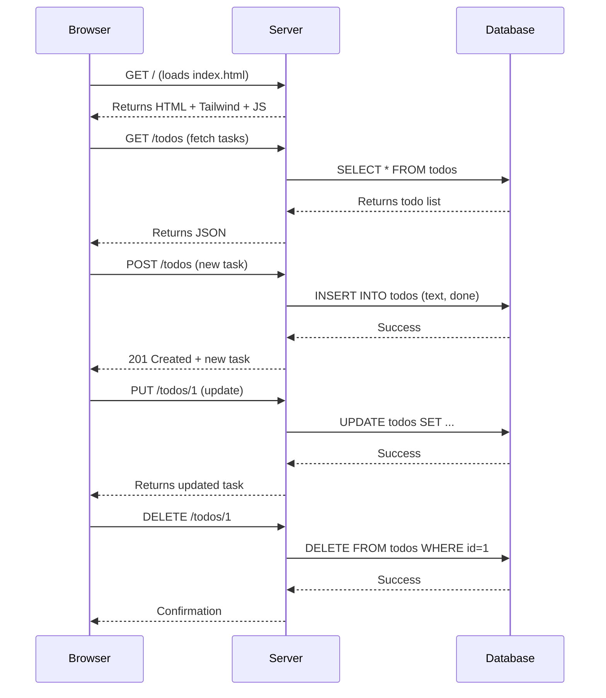

# 🚀 Todo API with Hono.js & SQLite

A lightweight, full-stack todo application built with **Hono.js**, **Bun**, and **SQLite**, featuring a clean frontend and persistent local storage.


---

## 📖 Overview

This project demonstrates a **rapid prototype** of a full-stack application using modern tools:

- **Backend**: Hono.js (ultra-fast web framework)
- **Runtime**: Bun (blazing-fast JavaScript runtime)
- **Database**: SQLite with `bun:sqlite` (zero dependencies)
- **Frontend**: Lightweight HTML + Tailwind CSS (via CDN) + Vanilla JS
- **Persistence**: Data saved in `todos.db` (survives restarts)

Perfect for learning, demos, or bootstrapping a new idea.

---

## 🧩 Features

✅ List, create, update, and delete todos
✅ Real-time UI updates
✅ Persistent storage with SQLite
✅ No external dependencies for the database
✅ Hot reload during development
✅ Clean, responsive UI with Tailwind CSS
✅ Comprehensive unit and integration tests with `bun:test`

---

## 🏗️ Architecture

The app follows a simple full-stack structure:
Frontend (public/index.html)
↓ (HTTP requests)
Hono.js API (index.ts)
↓ (queries)
SQLite Database (todos.db)


All API routes are served from the same Bun server.

---

## 🔄 Sequence Diagram



## 🚀 How to Run

### 1. Install [Bun](https://bun.sh/)

```
curl -fsSL https://bun.sh/install | bash
```

### 2. Clone and run

```bash
git clone https://github.com/your-username/hono-todo-app.git
cd hono-todo-app
bun install
bun --hot server.ts
```

### 3. Open in browser

👉 [http://localhost:3000](http://localhost:3000/)

---

## 💾 Data Persistence

- All todos are stored in `todos.db` (SQLite)
- The database is created automatically on first run
- Data persists across server restarts

> Tip: Inspect the database with `bun sql todos.db`

---

## 🛠️ Tech Stack

|           |                                             |
| --------- | ------------------------------------------- |
| Runtime   | [Bun](https://bun.sh/)                      |
| Framework | [Hono.js](https://hono.dev/)                |
| Database  | `bun:sqlite`(native)                        |
| Frontend  | HTML + Tailwind CSS (CDN) + JS              |
| Hosting   | Ready for Vercel, Cloudflare, or standalone |


## 🧪 Testing

This project includes a **complete test suite** using Bun's native test runner: `bun:test`.

Tests cover:

- ✅ All CRUD operations (`GET`, `POST`, `PUT`, `DELETE`)
- ✅ Error handling (e.g., 400 for invalid input, 404 for missing resources)
- ✅ Database consistency
- ✅ Request/response validation

### 🔁 Test Isolation

Each test runs in isolation:

- Database is cleared before and after each test
- Uses in-memory operations during tests (but same schema as production)

### ▶️ How to Run Tests

```bash
bun test
```

Or watch mode:

```bash
bun test --watch
```

> ✅ 100% test coverage on API endpoints
> ✅ Runs in milliseconds thanks to Bun's speed

---

## 📄 License

MIT © Luis Fernando Richter

---

> Made with ❤️ using modern web tools.


