# 🚀 Todo API with Hono.js & SQLite

A lightweight, full-stack to-do application built with **Hono.js**, **Bun**, and **SQLite**, featuring a clean frontend and persistent data storage.


      

-----

## 📖 Overview

This project is a prototype of a full-stack application that demonstrates the power and speed of modern tools. The tech stack was chosen to offer maximum performance with minimal configuration.

  - **Backend**: [Hono.js](https://hono.dev/), an ultrafast web framework for the edge.
  - **Runtime**: [Bun](https://bun.sh/), a modern and incredibly fast JavaScript runtime.
  - **Database**: SQLite through the native `bun:sqlite` module, with zero external dependencies.
  - **Frontend**: HTML, Vanilla JS, and Tailwind CSS (via CDN) for a clean and responsive interface.

It's a perfect example for learning, creating demos, or bootstrapping a new idea.


-----

## ✨ Features

  - 🔄 **Full CRUD Functionality**: Create, read, update, and delete todos.
  - ⚡ **Reactive UI**: The interface updates in real-time after each operation, without needing complex frameworks.
  - 💾 **Data Persistence**: Todos are saved in a `todos.db` file, surviving server restarts.
  - 📦 **Zero DB Dependencies**: Uses the native and optimized `bun:sqlite` module.
  - 🔥 **Hot Reload**: Enjoy an agile development experience with Bun's native hot-reload.
  - 🎨 **Clean UI**: A responsive and minimalist interface built with Tailwind CSS.
  - 🧪 **Comprehensive Tests**: Full integration and unit test coverage for the API.

-----

## 🏗️ Architecture

The application follows a simple monolithic architecture, where the same Bun server is responsible for serving both the API and the static frontend files.

```mermaid
---
config:
  theme: default
  look: handDrawn
---
flowchart LR
    subgraph "Client"
        A["🌐 Frontend<br>(HTML/JS/Tailwind)"]
    end
    subgraph "Server"
        B["🔥 Hono API<br>(server.ts)"]
    end
    subgraph "Database"
        C["🗄️ SQLite<br>(todos.db)"]
    end

    A -- HTTP Requests --> B
    B -- Queries (bun:sqlite) --> C
```



-----

## 🔄 Sequence Diagram (Data Flow)


-----

## 🚀 How to Run

### Prerequisites

Ensure you have [Bun](https://bun.sh/) installed.

```bash
curl -fsSL https://bun.sh/install | bash
```

### Installation & Running

1.  **Clone the repository:**
    ```bash
    git clone https://github.com/your-username/hono-todo-app.git
    cd hono-todo-app
    ```
2.  **Install dependencies:**
    ```bash
    bun install
    ```
3.  **Start the development server (with hot-reload):**
    ```bash
    bun --hot server.ts
    ```
4.  **Open in your browser:**
    Navigate to 👉 [http://localhost:3000](https://www.google.com/search?q=http://localhost:3000/)

-----

## 🛠️ Tech Stack

| Category  | Technology                                    |
| :-------- | :-------------------------------------------- |
| Runtime   | 🐰 [Bun](https://bun.sh/)                      |
| Framework | 🔥 [Hono.js](https://hono.dev/)                |
| Database  | 🗄️ SQLite (via native `bun:sqlite`)            |
| Frontend  | 🎨 HTML + Tailwind CSS (CDN) + Vanilla JS      |
| Testing   | 🧪 `bun:test` (Bun's native test runner)       |
| Hosting   | ☁️ Ready for Vercel, Cloudflare, or standalone |

-----

## 🧪 Testing

This project includes a complete test suite using Bun's native test runner, `bun:test`, ensuring the API's reliability.

#### Test Coverage:

  - 🔄 **CRUD Operations**: Validation for all `GET`, `POST`, `PUT`, and `DELETE` routes.
  - ⚠️ **Error Handling**: Tests for error scenarios like invalid input (400) and resources not found (404).
  - 🔒 **Database Consistency**: Ensures the database state is correct after each operation.
  - 🤝 **Schema Validation**: Verifies that requests and responses follow the expected format.

#### Test Isolation:

Each test runs in an isolated environment. The database is cleared before and after each test to ensure there is no interference between them.

#### How to Run Tests:

```bash
# Run all tests once
bun test

# Run in "watch" mode to re-run on changes
bun test --watch
```

> ✅ 100% test coverage for API endpoints.
> ✅ Runs in milliseconds thanks to Bun's speed.

-----

## 📄 License

Distributed under the MIT License. See `LICENSE` for more information.

MIT © Luis Fernando Richter

-----

> Made with ❤️ using modern web tools.
